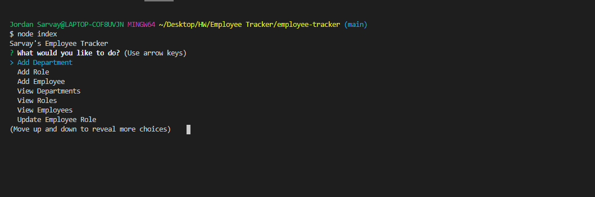
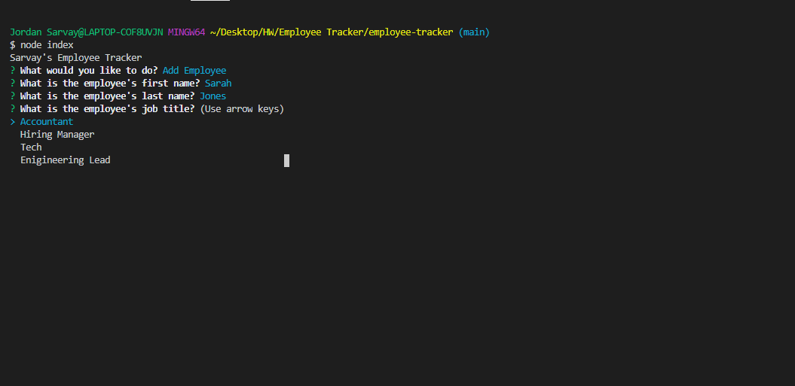
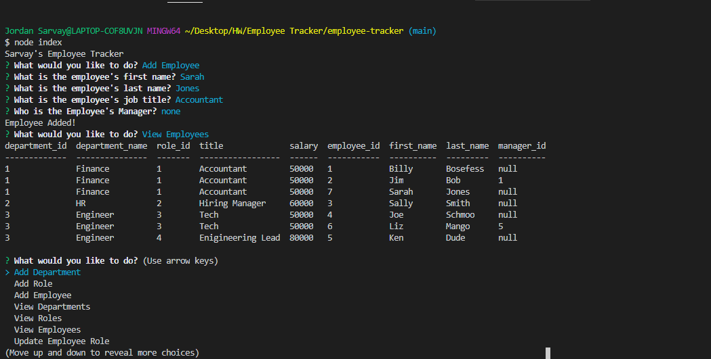

# Employee Tracker
### Created by Jordan Sarvay

## Description
Using node and mysql, the user can run a series of command line prompts to manage three databases for their employees.

## Table of Contents
* [Installation](#installation)
* [Usage](#usage)
* [Contributing](#contributing)
* [Testing](#testing)
* [Questions](#questions)
    
## Installation

perform a git clone from github to copy files to your local drive. From there, perform an 'npm i' in order to get all necessary dependencies. Finally, run the schema.sql code in mysql workbench in order to create the databases.
    
## Usage

Once installation is complete, you may run 'node index' in order to start the series of inquirer prompts. Add department, role, and employee will add the applicable information to its respective table. View will allow you to read through the databases based on how you would like to see it broken down. Update employee will allow the user to update the employee's role to another position.
    
## Contributing

If you are interested in contributing to this project, reach out to the creator to have a working branch established to upload to. All branches will be merged by the content creator to ensure a consistent app experience.

## Testing

No test files were created for this app, though in future deployment they will be created and run through JEST.
    
## Questions

Please feel free to reach out to either of the following links with questions regarding the use of this application.

##### Github: [JSarvay](http://github.com/JSarvay/)
##### E-mail: jordans1@vt.edu

